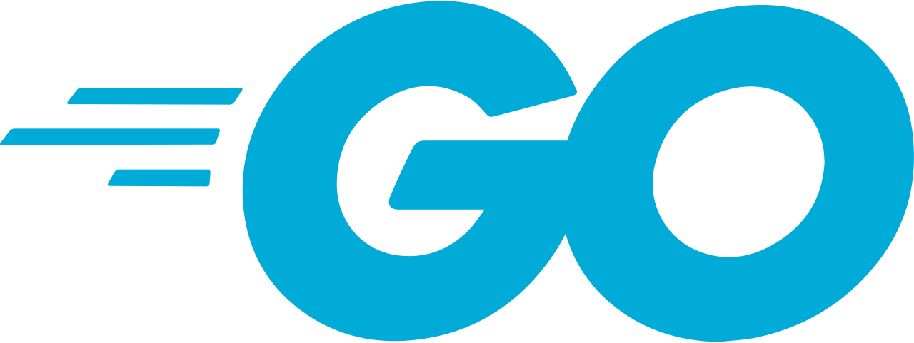
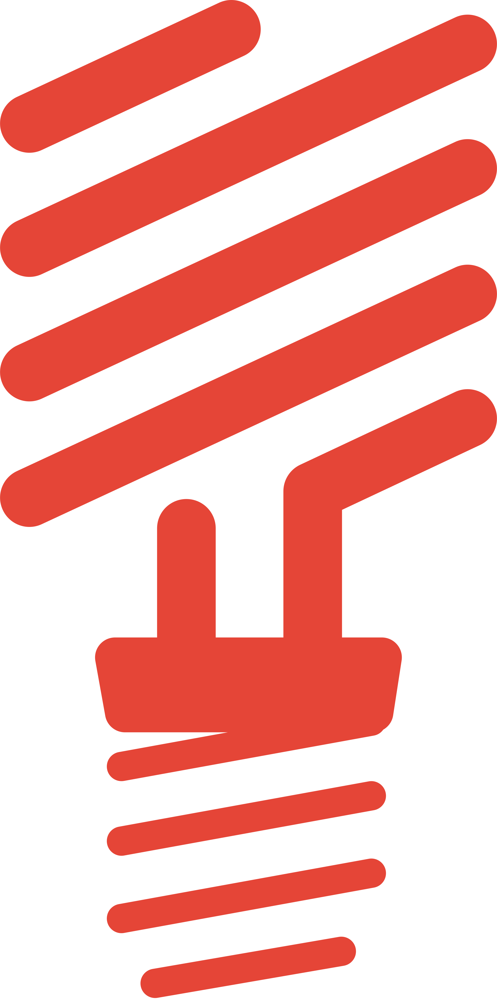
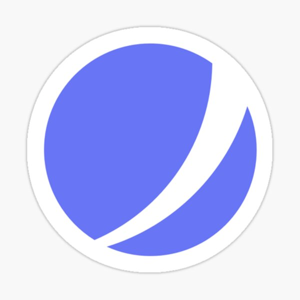

<!-- Header -->
<h1 align="center">
  
   
  
    
  Hi, I'm Imam Hadid Gunawan - aka HaDit
   
</h1>

<!-- Counter -->

  

  <b> I'm a passionate programmer and interested in new learning </b>

 

 

- ♒ I am used to **Self-Study**, and like to try **New Technology**.
- 📓 I'm a student of [Mulia University Balikpapan](https://universitasmulia.ac.id/).
- 👨🏻‍💻 I am working at [Mulia University Balikpapan](https://universitasmulia.ac.id/) as a **Backend Crew Project**.
- 🌱 I’m currently focusing on **Backend Web Development** and practicing **Frontend Web Development** everyday.
- All of my projects are **Private** so there's not much I can show you, only **Assignments From Campus** can be shared 😔.
- Show ❤ by giving ⭐ to my Repositories, at least your star could make someone's day 😄.

 

<!-- My activity -->
<h2>My activity</h2>

  
<b>💻 GitHub Profile Stats</b>

   
  

    
     
	  
     
    <b>Note:</b> Top languages is only a metric of the languages my public code consists of and doesn't reflect experience or skill level.
  

  
   

<!-- Tech stack -->
<h2>Tech stack 🔭</h2>

  <b>Languages</b>
   
   
  <a href="https://en.wikipedia.org/wiki/C_(programming_language)" target="_blank">
    <code></code>
  </a>
  <a href="https://developer.mozilla.org/en-US/docs/Web/JavaScript" target="_blank">
    <code></code>
  </a>
  <a href="https://www.php.net" target="_blank">
    <code></code>
  </a>
   
  <a href="https://go.dev" target="_blank">
    <code></code>
  </a>

 
 

  <b>Frontend</b>
   
   
  <a href="https://developer.mozilla.org/en-US/docs/Web/HTML" target="_blank">
    <code></code>
  </a>
  <a href="https://developer.mozilla.org/en-US/docs/Web/CSS" target="_blank">
    <code></code>
  </a>
  <a href="https://developer.mozilla.org/en-US/docs/Web/JavaScript" target="_blank">
    <code></code>
  </a>
   
  <a href="https://vuejs.org/" target="_blank">
    <code></code>
  </a>

 
 

  <b>Backend</b>
   
   
  <a href="https://nodejs.org" target="_blank">
    <code></code>
  </a>
   
  <a href="https://expressjs.com" target="_blank">
    <code></code>
  </a>
  <a href="lumen.laravel.com" target="_blank">
    <code></code>
  </a>
  <a href="https://firebase.google.com/" target="_blank">
    <code></code>
  </a>
   
  <a href="https://www.mysql.com" target="_blank">
    <code></code>
  </a>

 
 

  <b>System & DevOps</b>
   
   
  <a href="https://en.wikipedia.org/wiki/Linux" target="_blank">
    <code></code>
  </a>
  <a href="https://www.nginx.com" target="_blank">
    <code></code>
  </a>
  <a href="https://www.heroku.com" target="_blank">
    <code></code>
  </a>

 
 

  <b>Other</b>
   
   
  <a href="https://jetstream.laravel.com/" target="_blank">
    <code></code>
  </a>
  <a href="https://laravel.com/" target="_blank">
    <code></code>
  </a>

<!-- Connection -->
<h2> Connect with me</h2>

  <a href="https://www.instagram.com/adit_vanh" target="_blank">
    <code></code>
  </a>

---

Website: [HaDit](https://imamhadid.github.io/)
 
Credits: [imamhadid](https://github.com/imamhadid)
